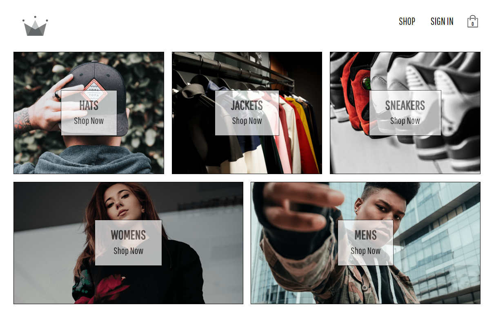

# Crwn Online clothing Store - React, Firebase, Sass and Styled-Components Project

Deployed on Netlify: https://moonlit-griffin-407179.netlify.app/

Project functionalities:

- Homepage to quick access clothes categories
- Authentication page with a login with mail and password or with Google section and a sign-up section
- Shop page with Expand category and "Add to card" functionalities
- Cart dropdown (a small display of cart items)
- Checkout page with add, remove or delete cart items functionalities

The app is part of ZTM Academy React Course.
